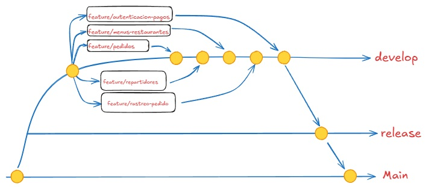

# Proyecto delivery-app
Aplicación de consola funcional que simule una plataforma de delivery de alimentos.

## 01 - Github y Gitflow
* El proyecto seguira el marco de trabajo de gitflow. 

* **git clone https://github.com/EmilioM1983/delivery-app.git ** -> clona el proyecto base

* Al clonar el proyecto debe seguirse los siguientes pasos:
    * **git branch** -> Indica que estan sobre la rama main
    * **git checkout develop** -> Cambiar a develop
    * **git pull origin develop** -> Asegurarse de tener la última versión
    * **git checkout -b feature/tu-modulo** -> Crear su rama feature  
* Realizan sus tareas y luego:
   **git push origin feature/tu-modulo** -> Suben su rama al remoto

## 02 - Estructura del proyecto base
deliveryapp -> src -> main -> java -> org.IngSoft 
* **database** -> Clase "Conexion.java" (Se debe colocar el usuario y password del servicio mysql instalado en su pc).
* **models** -> Aquí esta el modelado de las clases que utilizara el sistema (para estandarizar su uso entre los grupos).
* **repositories** -> Aqui se definiran las clasesDAO (Data Access Object) que realizan la funcion de interactuar directamente con la base de datos.
* **services** -> Aquí se definiran las clases e interfaces de servicios que realizan la lógica de negocio de la aplicación.
* **ui** -> Aqui see definira la clase la intefaz de usuario (Consola).

## 03 - Bases de datos
* En el directorio: "deliveryapp/sql" se encuentran los siguiente archivos para la generacion de la base de datos.
  * Crea_db.sql: Script para generar la base de datos relacional con mysql.
  * Datos de ejemplo.sql: Genera datos ficticios dentro de la base de datos para poder llevar acabo las tareas de todos los modulos.
  * model.mwb: Modelo entidad - relación

## 04 - Ejecutar el proyecto base
* Si todo salio bien al ejecutarse el proyecto base debe enviar a pantala dos cuadros de dialogo en forma secuencial con los siguiente mensajes:
  1. Conexion exitosa
  2. Conexion terminada
